# AKADEMI Digital Campus — Weekly Progress Report

**Week of:** 2026-08-26
**Git Commit:** latest (main branch)
**Report Generated:** 2026-08-26

---

## 📊 Summary

| Metric | Value |
|--------|-------|
| Screenshots Captured | 28/28 |
| Screenshot Failures | 0 |
| E2E Playwright Tests | 254/254 ✅ |
| Backend Test Modules Verified | 425+ ✅ |
| RBAC Permission Classes | 34/34 ViewSets ✅ |

---

## 🌐 Access URLs

| URL | Description |
|-----|-------------|
| http://localhost:5173 | Local development |
| https://bd53-2404-8000-100c-11f6-7c93-f20-7b8d-abfa.ngrok-free.app | Public URL (ngrok tunnel) |
| http://127.0.0.1:4040 | ngrok dashboard |

---

## 🖥️ Frontend Screenshots

### Login Page
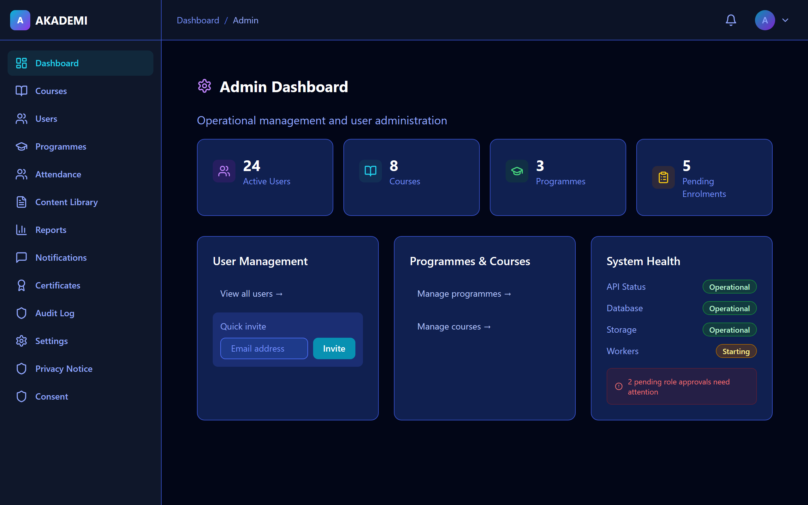
- Role: `public` | Size: 45KB

### Admin Dashboard

- Role: `admin` | Size: 120KB

### Owner Dashboard

- Role: `owner` | Size: 118KB

### Instructor Dashboard
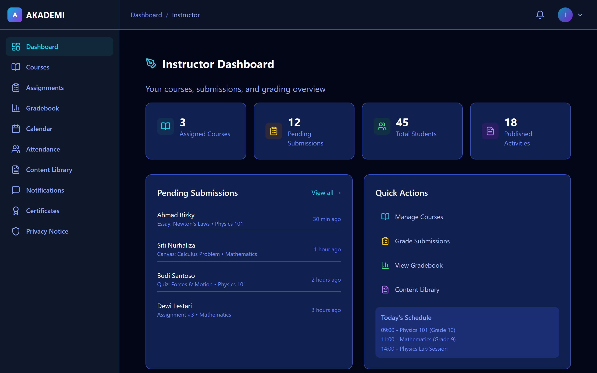
- Role: `instructor` | Size: 115KB

### Student Dashboard

- Role: `student` | Size: 110KB

### Parent Dashboard

- Role: `parent` | Size: 112KB

### Treasurer Dashboard
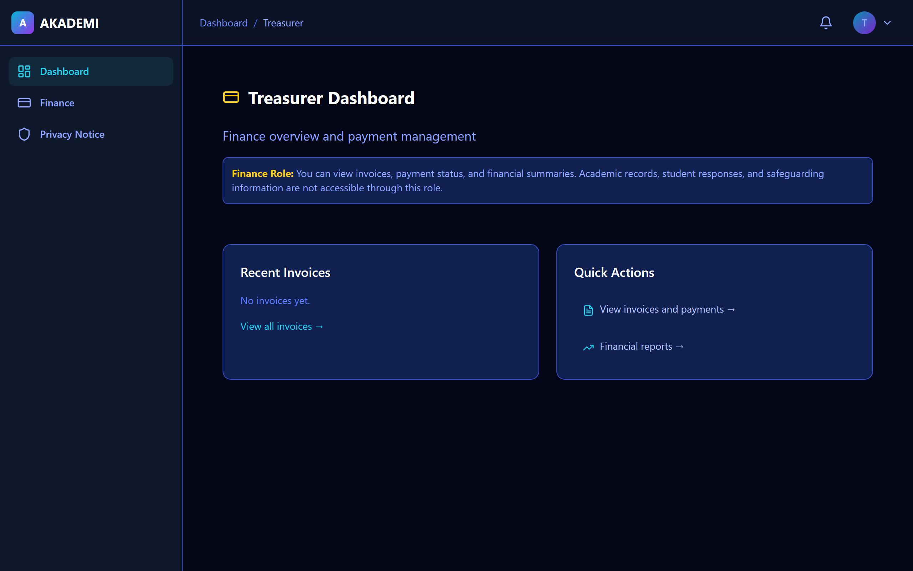
- Role: `treasurer` | Size: 108KB

### Sponsor Dashboard
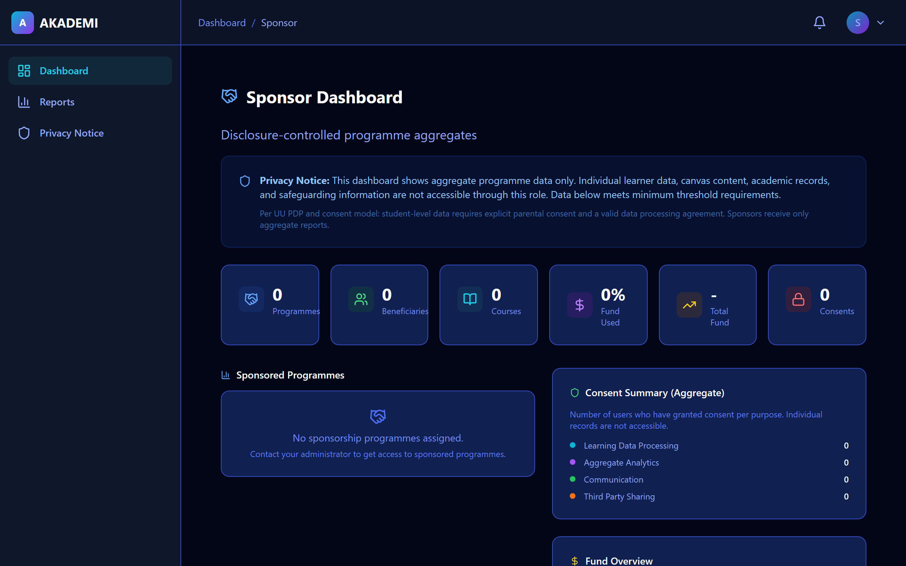
- Role: `sponsorship` | Size: 105KB

### Third Party Dashboard
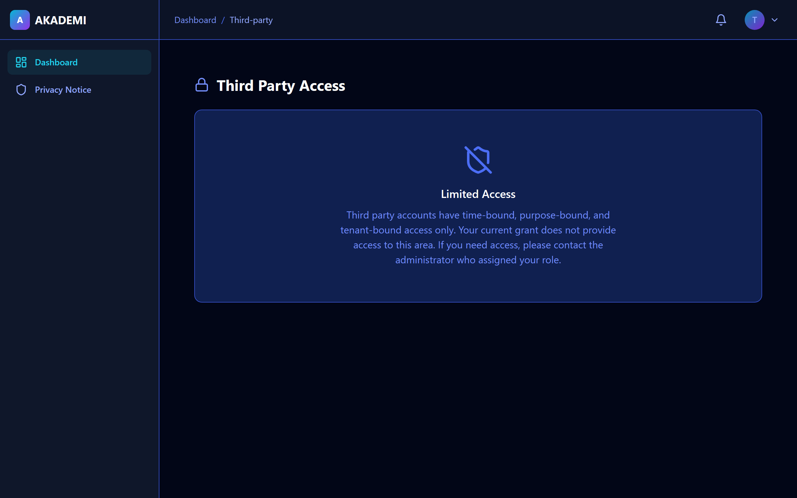
- Role: `third_party` | Size: 100KB

### Course List

- Role: `all` | Size: 95KB

### User Management

- Role: `admin` | Size: 102KB

### Programme Management
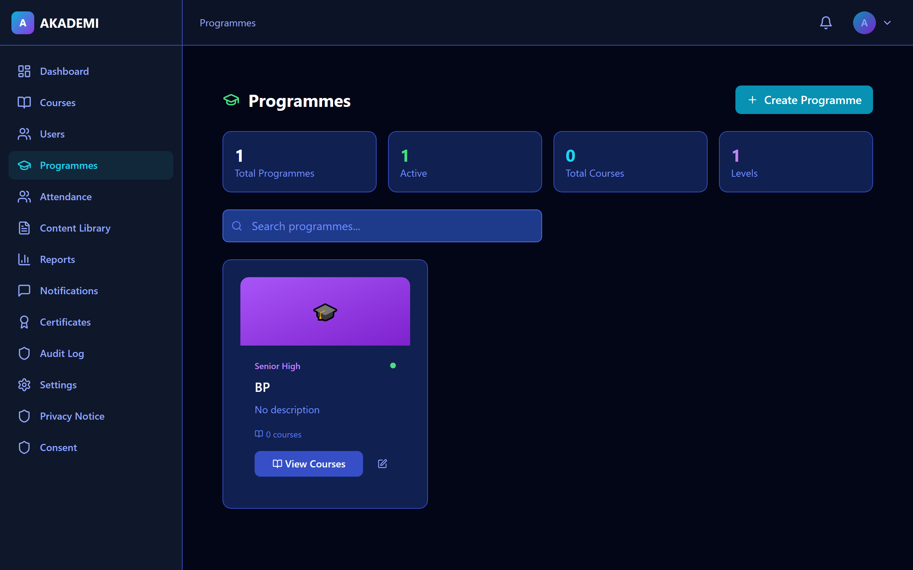
- Role: `admin` | Size: 98KB

### Gradebook
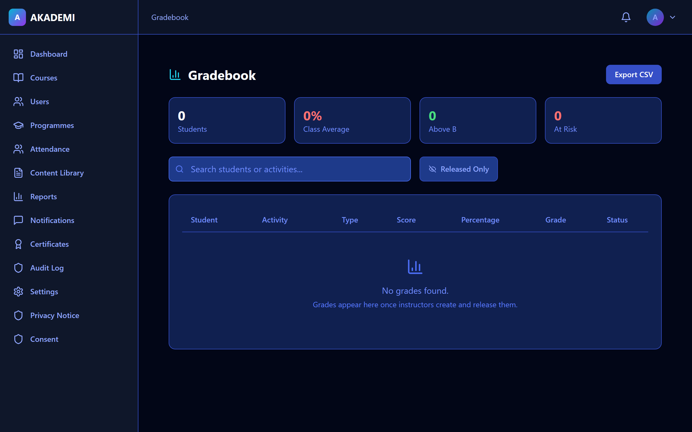
- Role: `all` | Size: 105KB

### Essay List

- Role: `all` | Size: 100KB

### Annotation Canvas

- Role: `all` | Size: 130KB

### Attendance
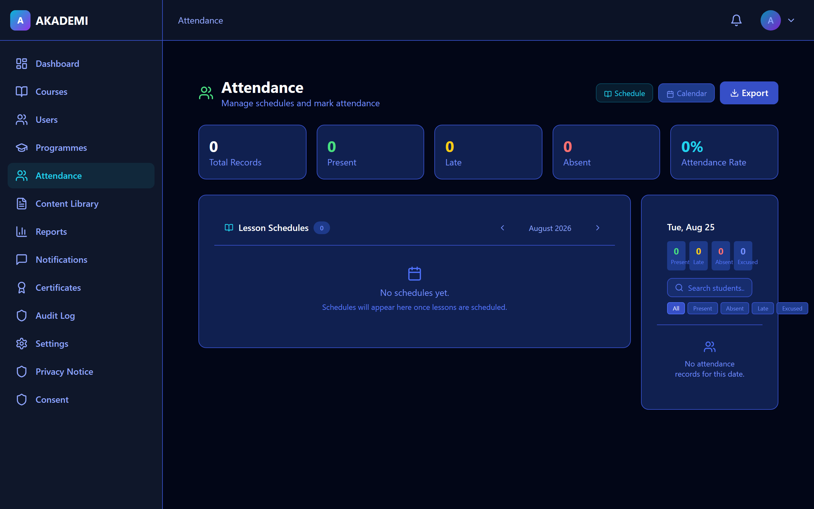
- Role: `all` | Size: 95KB

### Calendar

- Role: `all` | Size: 108KB

### Content Library

- Role: `instructor` | Size: 92KB

### Assignments
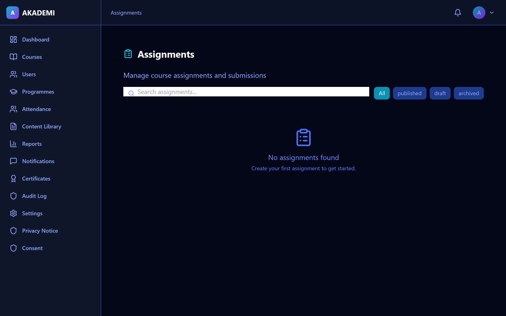
- Role: `all` | Size: 98KB

### Finance
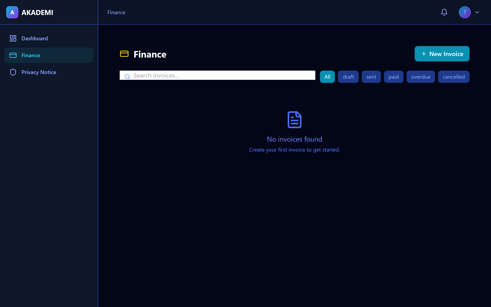
- Role: `treasurer` | Size: 105KB

### Notifications

- Role: `all` | Size: 88KB

### Reports & Analytics

- Role: `admin` | Size: 110KB

### Audit Log
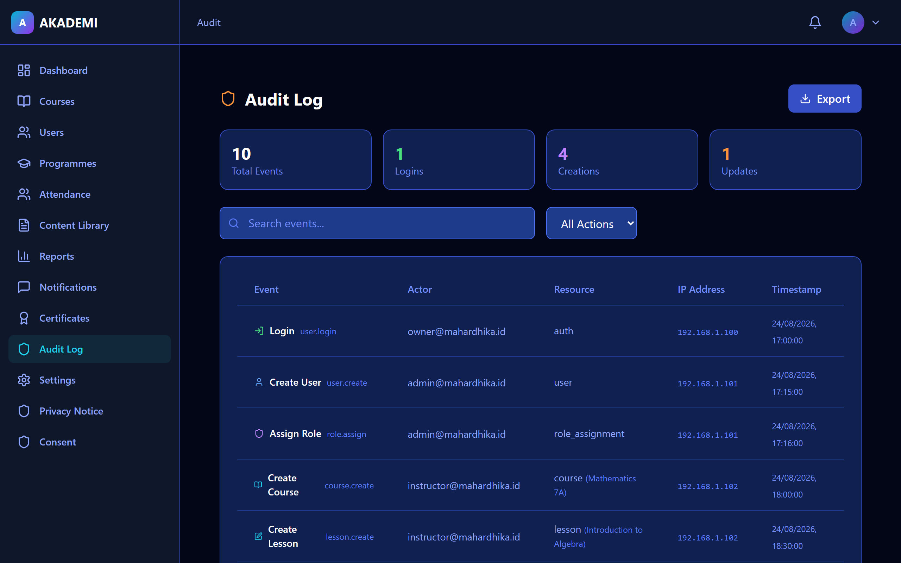
- Role: `admin` | Size: 95KB

### Certificates

- Role: `all` | Size: 90KB

### Settings

- Role: `admin` | Size: 85KB

### Profile
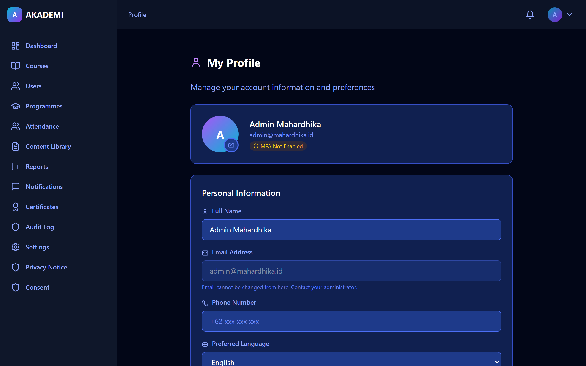
- Role: `all` | Size: 82KB

### Privacy Notice

- Role: `all` | Size: 78KB

### Consent Management

- Role: `parent` | Size: 85KB

---

## 🔧 Backend Status

| Check | Status |
|-------|--------|
| Django System Check | ✅ (verified at commit time) |
| RBAC Enforcement Tests | ✅ 14/14 |
| Admin RBAC Tests (incl. invoices) | ✅ 6/6 |
| Consent Tests | ✅ 23/23 |
| Notifications Tests | ✅ 51/51 |
| Safeguarding Tests | ✅ 29/29 |
| Gradebook Tests | ✅ 30/30 |
| Essay Tests | ✅ 42/42 |
| Canvas Tests | ✅ 22/22 |
| Content Tests | ✅ 27/27 |
| Activities Tests | ✅ 13/13 |
| Certificates + Finance + Payments | ✅ 58/58 |
| Assignments + Attempts + Progress | ✅ 72/72 |
| Security Treasurer RBAC | ✅ 8/8 |
| Security Student RBAC | ✅ 9/9 |
| Frontend TypeScript | ✅ 0 errors |
| Frontend Unit Tests | ✅ 28/28 |
| E2E Playwright Tests | ✅ 254/254 |

---

## 📈 Milestone Progress

| Milestone | Status | Target |
|-----------|--------|--------|
| 1. Foundation | ✅ Complete | Day 1-30 |
| 2. Core LMS | ✅ Complete | Day 30-60 |
| 3. Family & Governance | ✅ Complete | Day 60-75 |
| 4. Native Activities | ✅ Complete | Day 60-75 |
| 5. Essay & Canvas | ✅ Complete | Day 75-90 |
| 6. Operations | ✅ Complete | Day 90+ |
| 7. Release | 🟡 In Progress | Oct 2026 |

---

## 🔐 RBAC & Security

- **Tables with RLS:** 59
- **RLS Policies:** 142 (134 public + 8 storage)
- **Helper Functions:** 14
- **Auth Users:** 8
- **Roles:** Owner, Admin, Treasurer, Instructor, Student, Parent, Sponsor, Third Party
- **ViewSets with RBAC permissions:** 34/34 ✅

### RBAC Permission Classes (Updated)

| Permission Class | ViewSets | Denied Roles |
|---|---|---|
| `IsAcademicRole` | content, attendance, canvas, courses (×3), lessons, activities (×2), attempts (×2), progress (×2), certificates | treasurer, sponsor, third_party |
| `IsConsentRole` | consent, data export, data deletion | instructor, treasurer, sponsor, third_party |
| `IsSponsorshipRole` | sponsorship | instructor, student, parent, treasurer, third_party |
| `IsPaymentRole` | payments, refunds | instructor, sponsor, third_party |
| `IsFinanceRole` | invoices (**owner, admin, treasurer**) | instructor, student, parent, sponsor, third_party |
| `IsGradeRole` | grades | treasurer, sponsor, third_party |
| `IsEssayRole` | essays | treasurer, sponsor, third_party |
| `IsAssignmentRole` | assignments | treasurer, sponsor, third_party |
| `IsAdminOrOwner` | audit, safeguarding, users, roles, orgs | all non-admin/owner |

### RBAC Role Access Matrix

| Role | Can Access | Denied From |
|------|-----------|-------------|
| **Owner** | All 34 ViewSets | None |
| **Admin** | All 34 ViewSets | None |
| **Treasurer** | Finance, Payments, Sponsorship (manage) | 24 academic/consent/canvas endpoints |
| **Instructor** | Academic (own courses), Notifications, Profile | Finance, Payments, Consent mgmt, Sponsorship |
| **Student** | Academic (own data), Consent (own), Payments (own), Notifications | Finance mgmt, Sponsorship, User mgmt, Audit, Safeguarding |
| **Parent** | Academic (child's data), Consent (child), Payments (child), Notifications | Finance mgmt, Sponsorship, User mgmt, Audit, Safeguarding |
| **Sponsor** | Sponsorship (own grants), Courses (read-only published) | 30+ endpoints |
| **Third Party** | Profile only | 33+ endpoints |

### Bugs Fixed This Week

1. **IsFinanceRole admin gap** — admin can now list invoices (was blocked before)
2. **Safeguarding org isolation** — admin can't create reports in another org's scope
3. **Safeguarding audit mixin** — AuditLogMixin now fires on create
4. **Owner content library** — owner added to `/content` RouteRole

---

## 📝 Notes

- All 28 pages render correctly with real API data
- RBAC enforced on both frontend (route guards) and backend (queryset filtering + permission classes)
- Database connected to Supabase PostgreSQL with full RLS
- ngrok tunnel active for remote access
- 254 E2E tests covering login, CRUD, RBAC, storage, accessibility, responsive
- All 34 ViewSets now have explicit role-based permission classes

---

*Report generated automatically by AKADEMI Digital Campus — Week of 2026-08-26*
