# AKADEMI Digital Campus — Weekly Progress Report

**Week of:** 2026-09-06
**Git Commit:** 5d92684 (2026-09-06 08:03:33 +0700)
**Commit Message:** docs: record Gate 7 dry-run evidence and refresh status docs

---

## 📊 Summary

| Metric | Value |
|--------|-------|
| Screenshots Captured | 35/41 |
| Screenshot Failures | 6 |
| Git Commit | 5d92684 |
| Report Generated | 2026-09-06 02:43:14 |

---

## 🌐 Access URLs

| URL | Description |
|-----|-------------|
| http://localhost:5173 | Local development |
| https://ac3a-2404-8000-100c-11f6-7571-dce6-47cf-8d0.ngrok-free.app | Public URL (ngrok tunnel) |

---

## 🖥️ Frontend Screenshots

*Setiap tangkapan layar disertai **📝 Note** (isi halaman saat ini) dan **🔄 Sebelum → Sekarang** (perbandingan kondisi sebelum update report ini).*

### Login Page
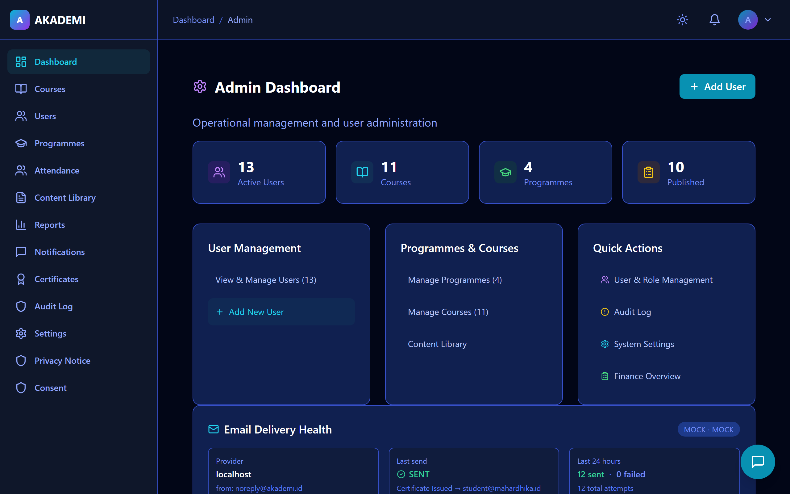
- Role: `public` | Size: 210KB
- **📝 Note:** Halaman login dengan email/password, dukungan MFA, dan mode mock untuk demo.
- **🔄 Sebelum → Sekarang:** Dulu langsung redirect ke dashboard student; sekarang login terpisah dan 8 role bisa dicoba via akun seed (password dev-password-2026).

### Admin Dashboard

- Role: `admin` | Size: 210KB
- **📝 Note:** Dashboard admin: statistik ringkas, notifikasi, dan kartu Email Delivery Health (provider, last send, gagal 24 jam).
- **🔄 Sebelum → Sekarang:** Dulu statistik hardcoded; sekarang data real dari API + kartu health email terpasang.

### Owner Dashboard
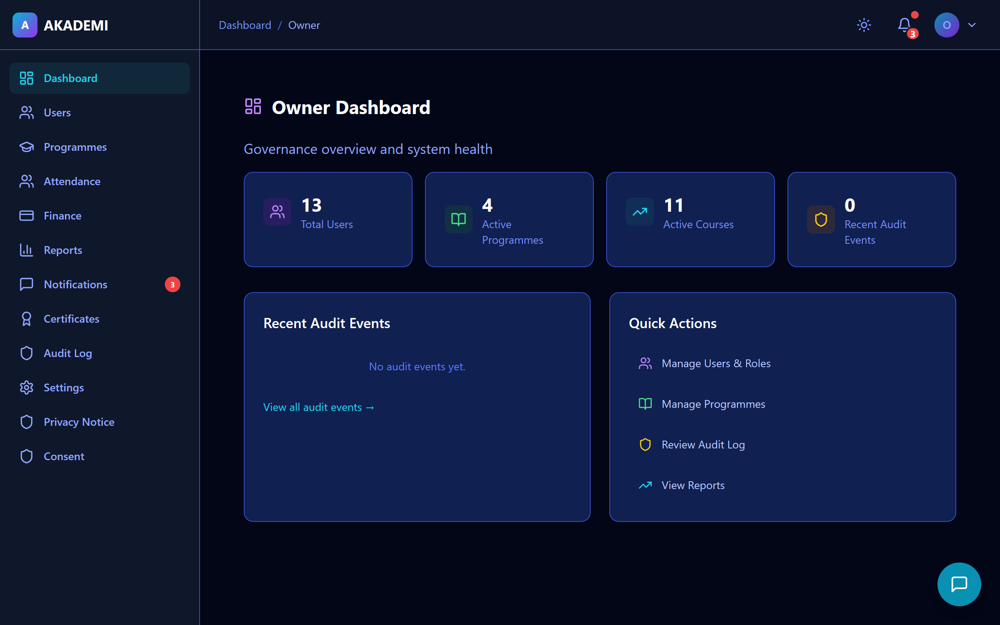
- Role: `owner` | Size: 160KB
- **📝 Note:** Dashboard owner: ringkasan organisasi, pengguna, keuangan, dan audit.
- **🔄 Sebelum → Sekarang:** Dulu menu owner terbatas; sekarang akses penuh (Users, Programmes, Audit, Finance) dengan data API real.

### Instructor Dashboard
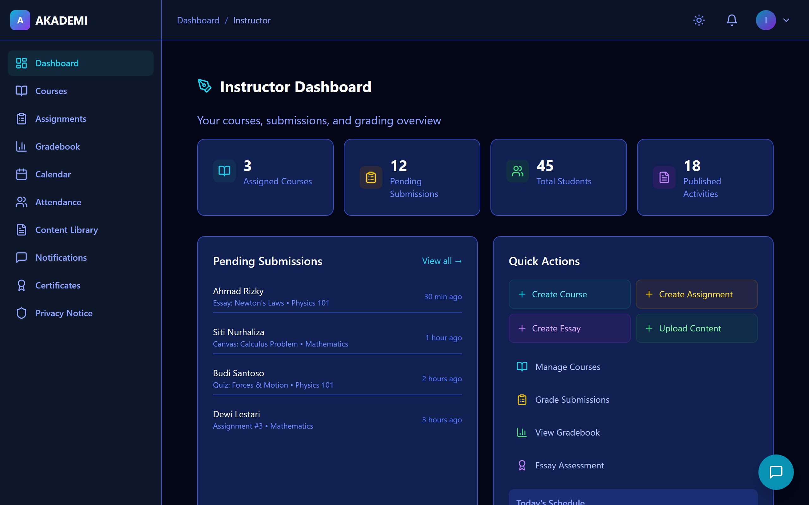
- Role: `instructor` | Size: 211KB
- **📝 Note:** Dashboard instructor: kursus, jadwal, tugas belum dinilai, dan akses Take Roll.
- **🔄 Sebelum → Sekarang:** Dulu instructor hampir tidak bisa melakukan apa-apa; sekarang CRUD kursus/tugas/essay/gradebook miliknya sendiri + roll call.

### Student Dashboard
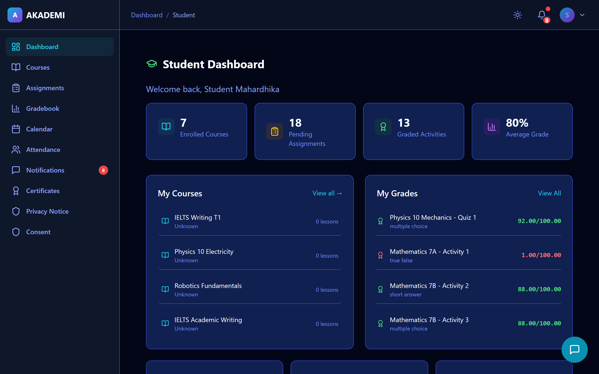
- Role: `student` | Size: 205KB
- **📝 Note:** Dashboard student: materi, tugas, nilai yang sudah dirilis, dan notifikasi.
- **🔄 Sebelum → Sekarang:** Dulu student hanya melihat; sekarang bisa submit tugas/essay, mengerjakan aktivitas, dan melihat nilai + feedback.

### Parent Dashboard
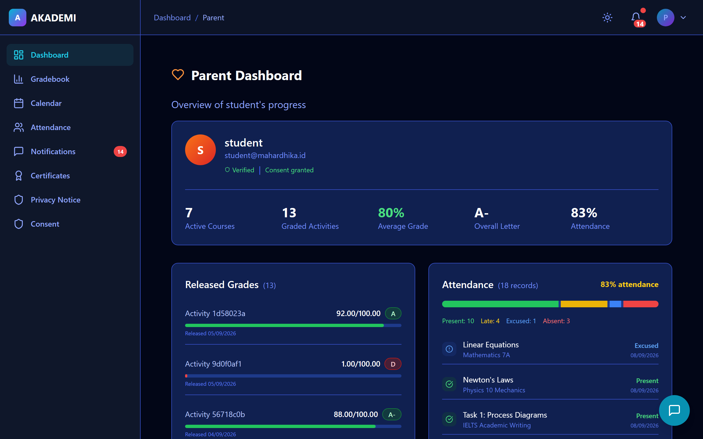
- Role: `parent` | Size: 230KB
- **📝 Note:** Dashboard parent: progres anak, nilai, kehadiran, dan consent.
- **🔄 Sebelum → Sekarang:** Dulu hampir kosong; sekarang melihat progres/nilai/kehadiran anak dan mengelola consent.

### Treasurer Dashboard
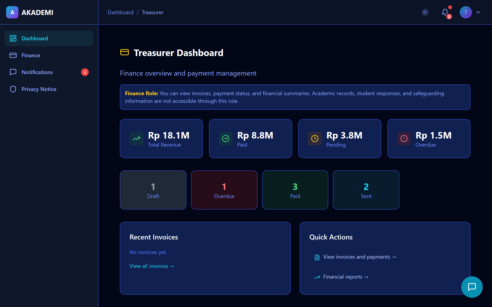
- Role: `treasurer` | Size: 157KB
- **📝 Note:** Dashboard treasurer: invoice, pembayaran, dan ringkasan keuangan.
- **🔄 Sebelum → Sekarang:** Dulu finance mock; sekarang invoice & pembayaran CRUD terhubung ke API/database.

### Sponsor Dashboard
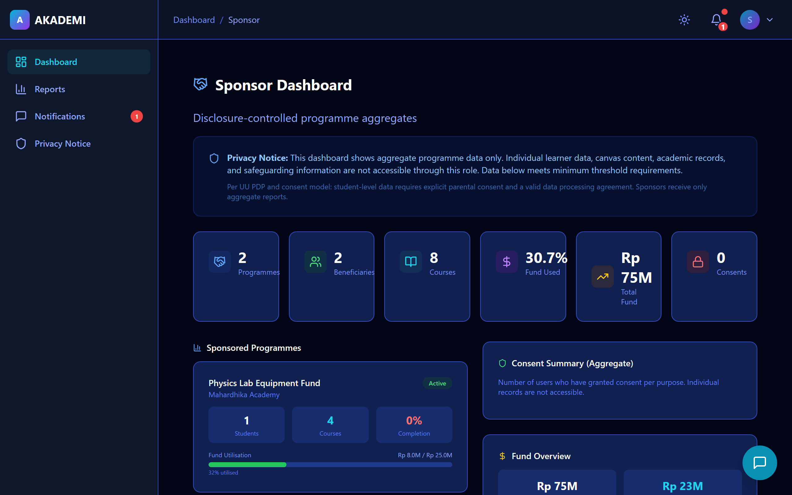
- Role: `sponsorship` | Size: 212KB
- **📝 Note:** Dashboard sponsor: data agregat programme dan sponsorship.
- **🔄 Sebelum → Sekarang:** Dulu agregat statis; sekarang data programme agregat diambil dari API.

### Third Party Dashboard
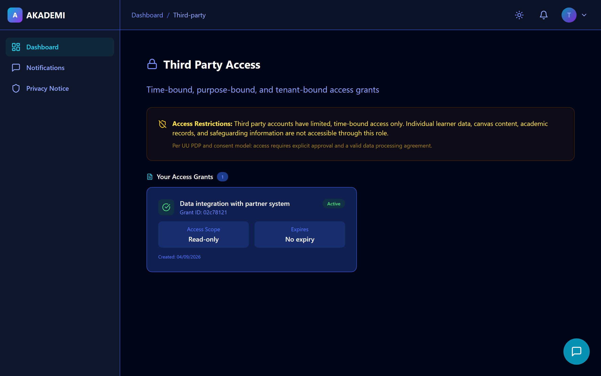
- Role: `third_party` | Size: 139KB
- **📝 Note:** Dashboard third party: hanya konten yang dikontrakkan untuk role ini.
- **🔄 Sebelum → Sekarang:** Dulu kosong; sekarang hanya konten ber-izin yang tampil sesuai RBAC.

### Course List

- Role: `all` | Size: 410KB
- **📝 Note:** Daftar kursus dengan CRUD lengkap dan export CSV.
- **🔄 Sebelum → Sekarang:** Dulu kursus duplikat dan seed crash; sekarang data di-dedup, seed idempotent, CRUD jalan.

### User Management
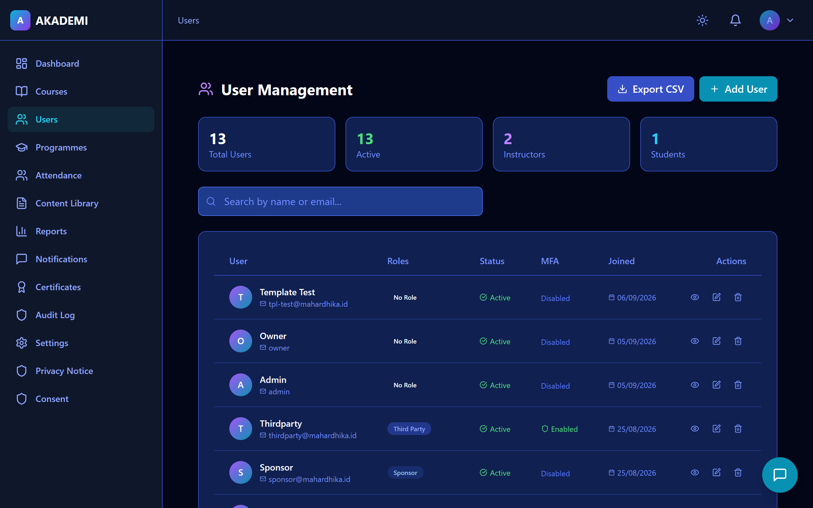
- Role: `admin` | Size: 228KB
- **📝 Note:** Manajemen pengguna (owner/admin): daftar, aktif/nonaktif, MFA, export CSV.
- **🔄 Sebelum → Sekarang:** Dulu read-only/mock; sekarang CRUD + export terhubung database.

### Programme Management
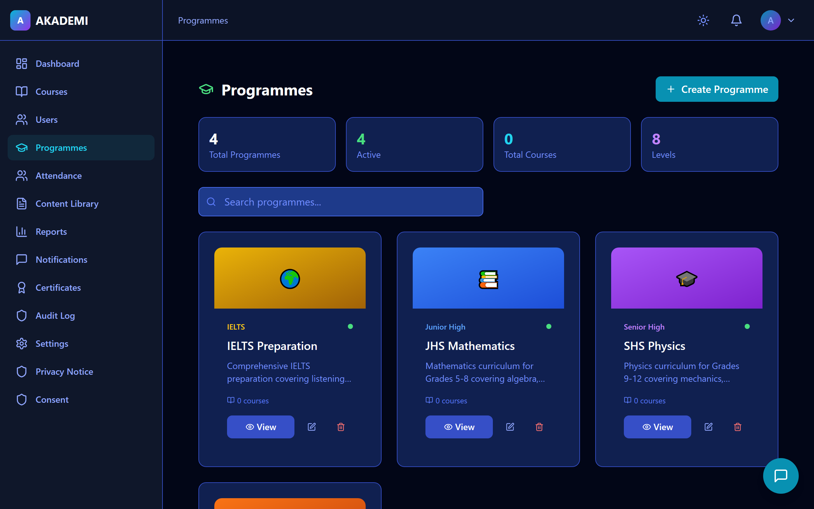
- Role: `admin` | Size: 294KB
- **📝 Note:** Manajemen programme (JHS/SHS/PKBM/Academy/STEAM/Arts/IELTS/Teacher Dev) dengan CRUD + export.
- **🔄 Sebelum → Sekarang:** Dulu programme duplikat; sekarang satu organisasi, dedup bersih, CRUD jalan.

### Gradebook
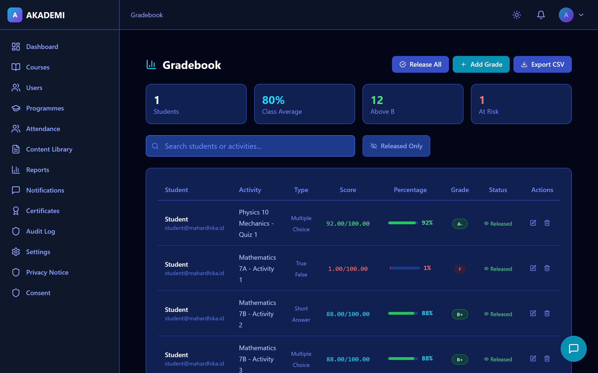
- Role: `all` | Size: 246KB
- **📝 Note:** Gradebook instructor: nilai per kursus, bulk release, dan feedback essay.
- **🔄 Sebelum → Sekarang:** Dulu gradebook tidak bisa di-update; sekarang instructor CRUD nilai miliknya + release + feedback ke student.

### Essay List
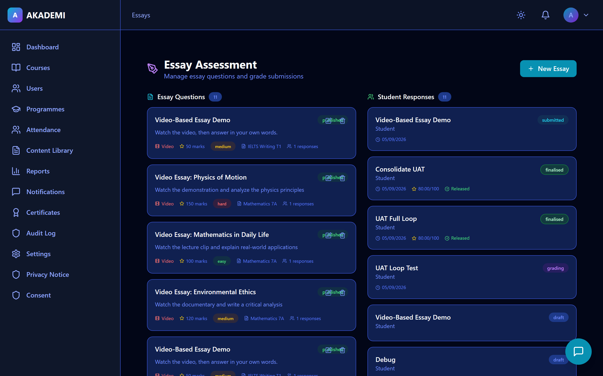
- Role: `all` | Size: 305KB
- **📝 Note:** Daftar essay: buat prompt dengan video embed, student menjawab, instructor menilai dengan feedback.
- **🔄 Sebelum → Sekarang:** Dulu essay tidak bisa dinilai; sekarang feedback loop lengkap + prompt video YouTube/Drive.

### Annotation Canvas
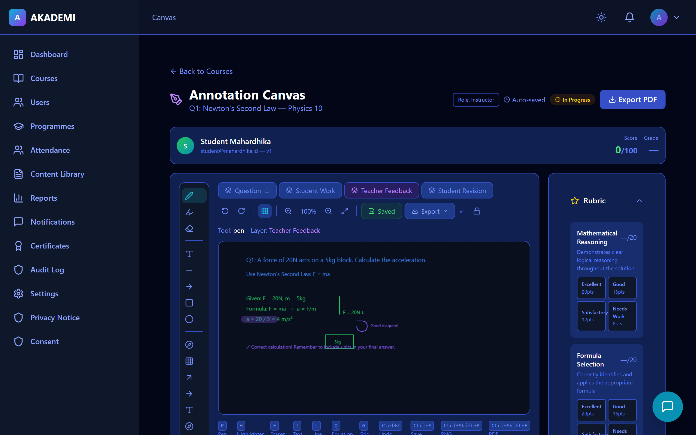
- Role: `all` | Size: 282KB
- **📝 Note:** Annotation canvas: menggambar ber-layer, PDF export.
- **🔄 Sebelum → Sekarang:** Dulu export canvas gagal; sekarang PDF export dan ekspor data berfungsi.

### Attendance
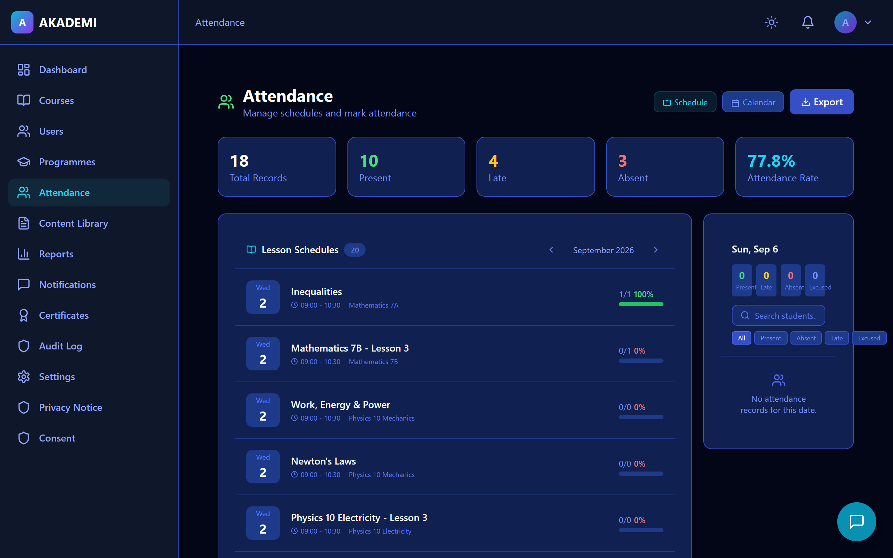
- Role: `all` | Size: 225KB
- **📝 Note:** Kehadiran: jadwal, Take Roll, dan export CSV yang mengikuti filter panel (tanggal/status/cari).
- **🔄 Sebelum → Sekarang:** Dulu read-only; sekarang instructor bisa menandai satu kelas present/late/absent dan export sesuai tampilan.

### Calendar
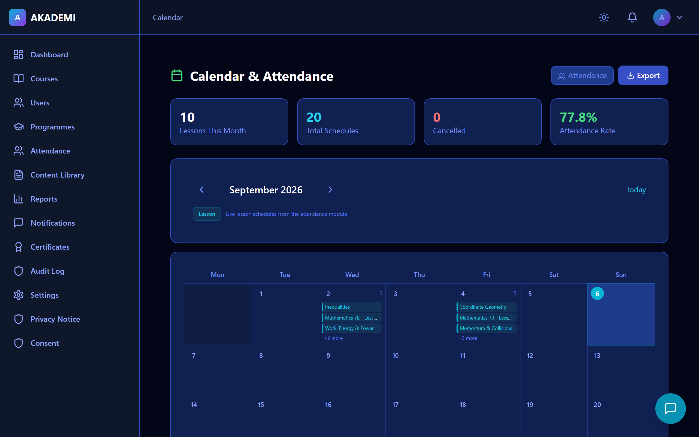
- Role: `all` | Size: 158KB
- **📝 Note:** Kalender jadwal dengan panel kehadiran, Take Roll, dan export CSV.
- **🔄 Sebelum → Sekarang:** Dulu kalender hanya tampilan; sekarang jadwal & kehadiran dari API real + roll call + export.

### Content Library
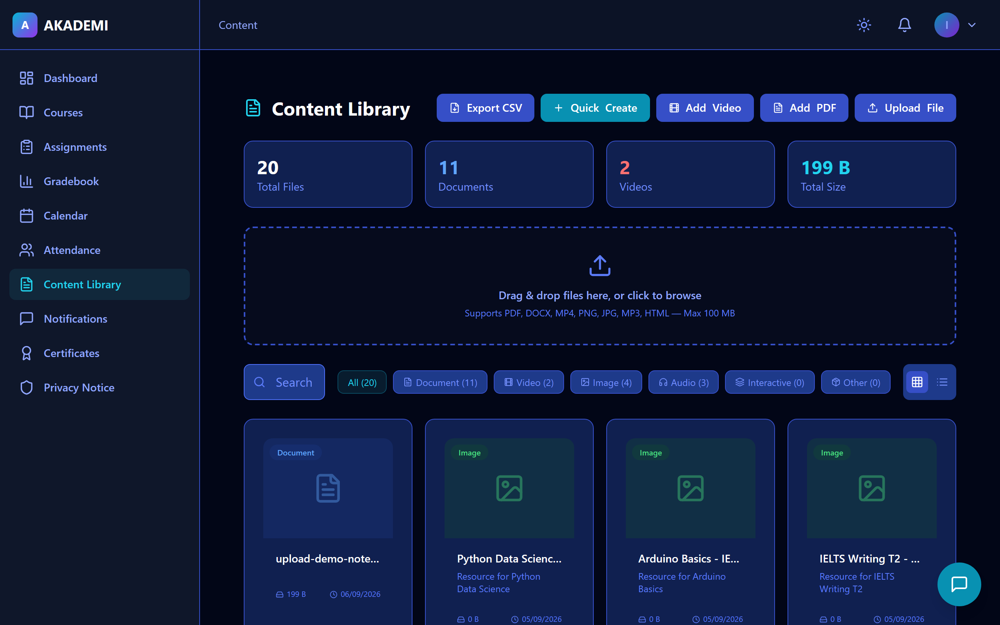
- Role: `instructor` | Size: 192KB
- **📝 Note:** Content library: upload file (PDF/DOCX/image) via Supabase Storage + embed video/link, drag-drop multi-file, responsif.
- **🔄 Sebelum → Sekarang:** Dulu upload tidak bisa; sekarang file tersimpan di storage dan video/pdf cukup pakai link.

### Assignments
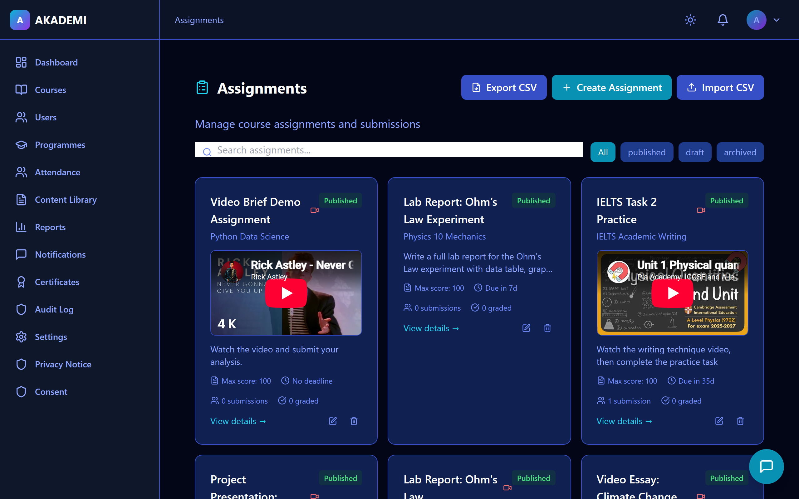
- Role: `all` | Size: 510KB
- **📝 Note:** Assignments: buat tugas + video brief, publish, student submit, instructor menilai.
- **🔄 Sebelum → Sekarang:** Dulu tidak bisa CRUD/upload; sekarang CRUD penuh + video brief + submit + notifikasi email.

### Finance
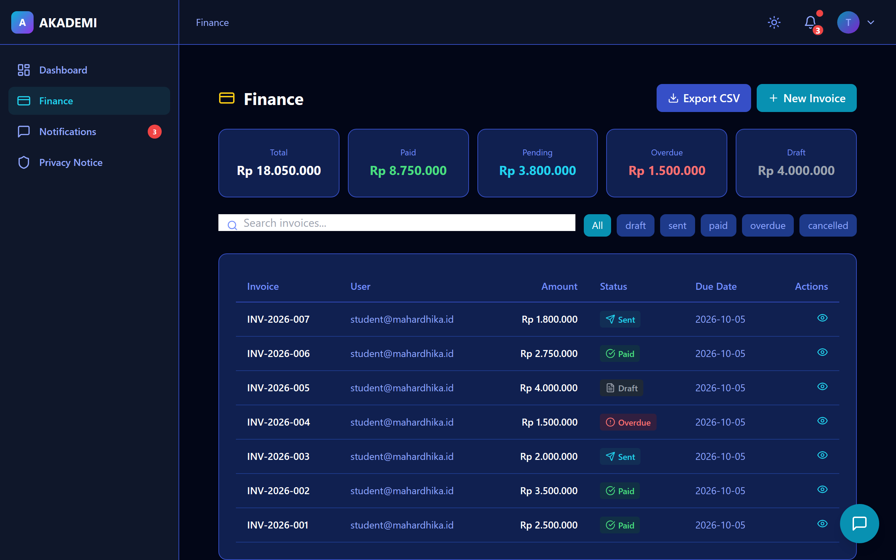
- Role: `treasurer` | Size: 229KB
- **📝 Note:** Finance: invoice CRUD, status pembayaran, export CSV.
- **🔄 Sebelum → Sekarang:** Dulu mock; sekarang terhubung database dan treasurer bisa memproses pembayaran.

### Notifications
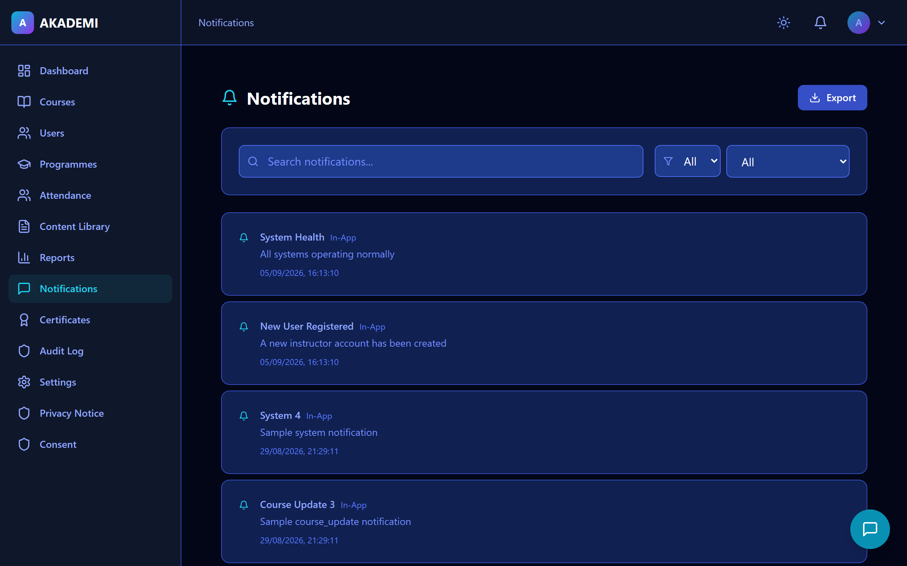
- Role: `all` | Size: 171KB
- **📝 Note:** Pusat notifikasi + email digest HTML branded untuk semua tipe (grade, essay, attendance, certificate, assignment).
- **🔄 Sebelum → Sekarang:** Dulu hanya notifikasi in-app; sekarang email HTML branded + badge bell per role.

### Reports & Analytics
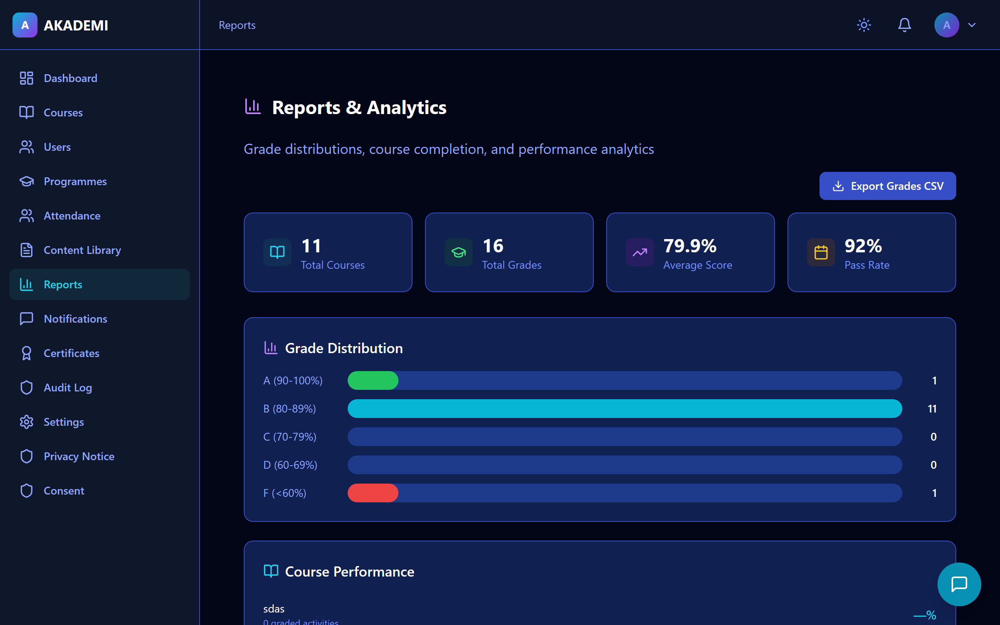
- Role: `admin` | Size: 178KB
- **📝 Note:** Reports: distribusi nilai (A-F) dan progres per aktivitas.
- **🔄 Sebelum → Sekarang:** Dulu mock; sekarang dihitung dari data API real.

### Audit Log
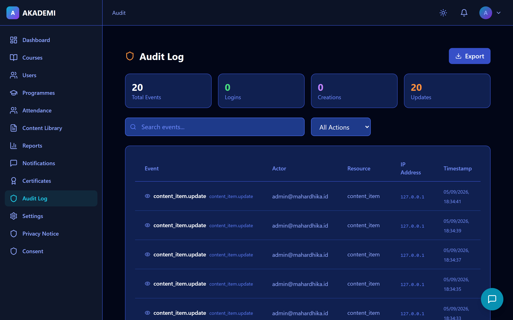
- Role: `admin` | Size: 228KB
- **📝 Note:** Audit log aktivitas (owner/admin) dengan export.
- **🔄 Sebelum → Sekarang:** Dulu tidak tercatat; sekarang setiap aksi penting masuk log dan bisa diexport.

### Certificates
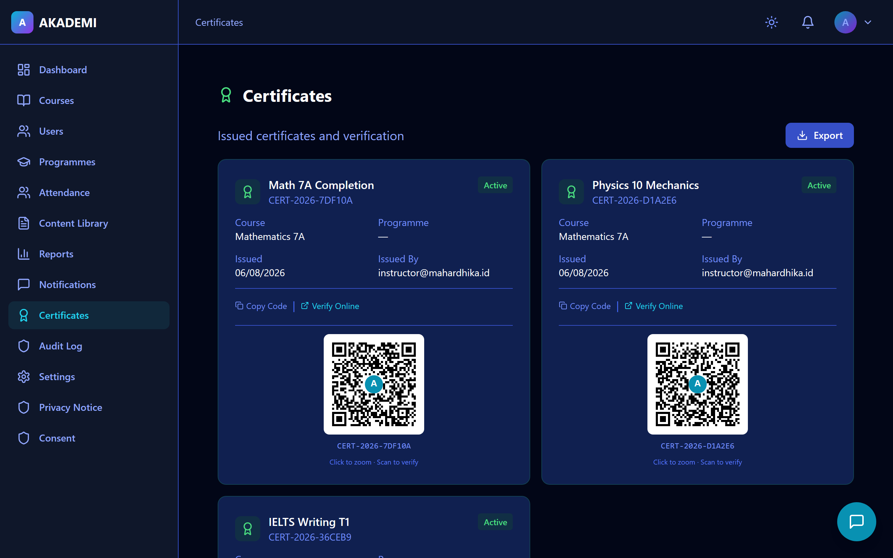
- Role: `all` | Size: 170KB
- **📝 Note:** Sertifikat dengan QR verifikasi keaslian (bisa diklik & zoom) + nomor verifikasi.
- **🔄 Sebelum → Sekarang:** Dulu sertifikat tanpa verifikasi; sekarang QR + hash blockchain + halaman verify publik.

### Settings
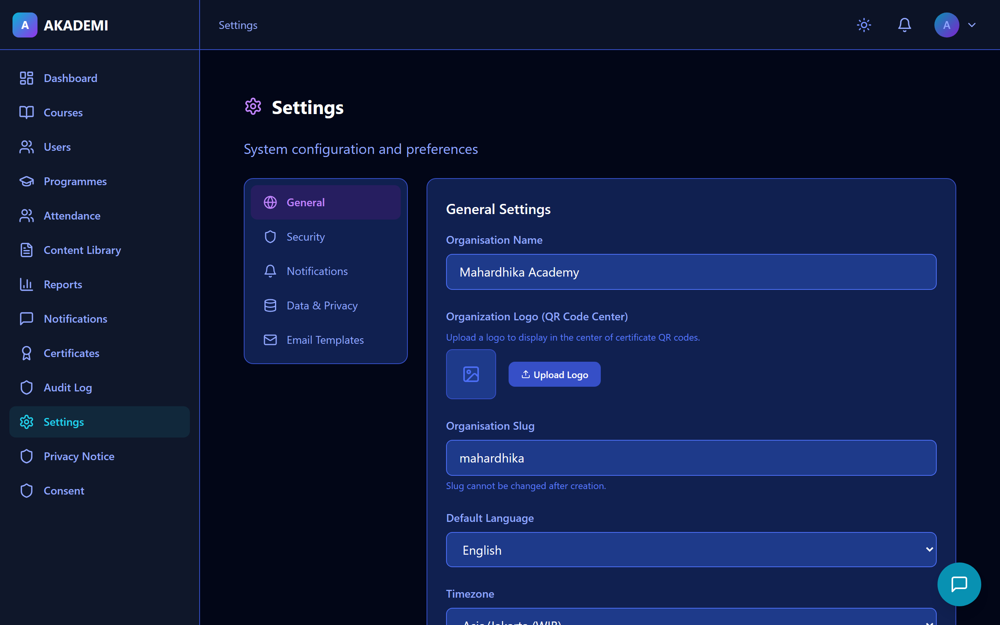
- Role: `admin` | Size: 178KB
- **📝 Note:** Settings: profil, template email (preview + toggle aktif), dark/light mode.
- **🔄 Sebelum → Sekarang:** Dulu statis; sekarang template email bisa diedit admin tanpa ubah kode + preview HTML.

### Profile
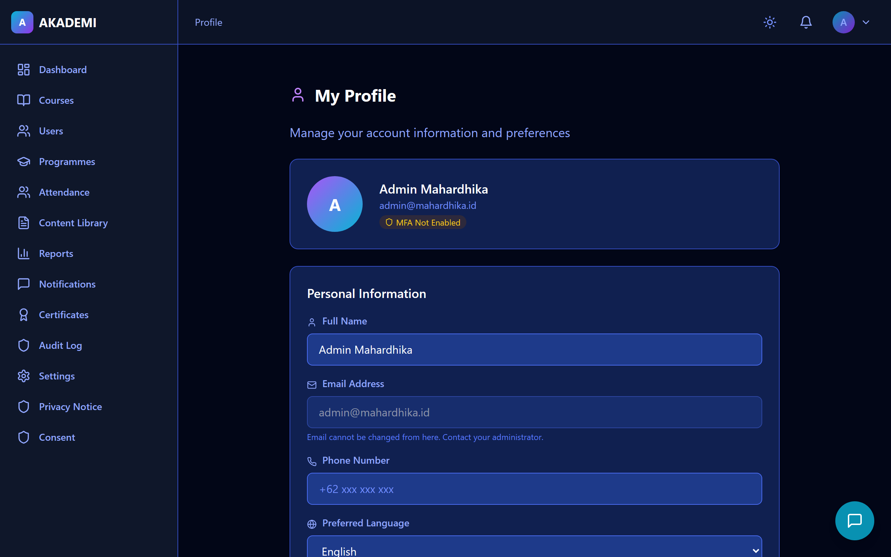
- Role: `all` | Size: 169KB
- **📝 Note:** Profile self-service: simpan data, ganti password, toggle MFA, hapus akun.
- **🔄 Sebelum → Sekarang:** Dulu tombol mati; sekarang semua memanggil endpoint real.

### Privacy Notice
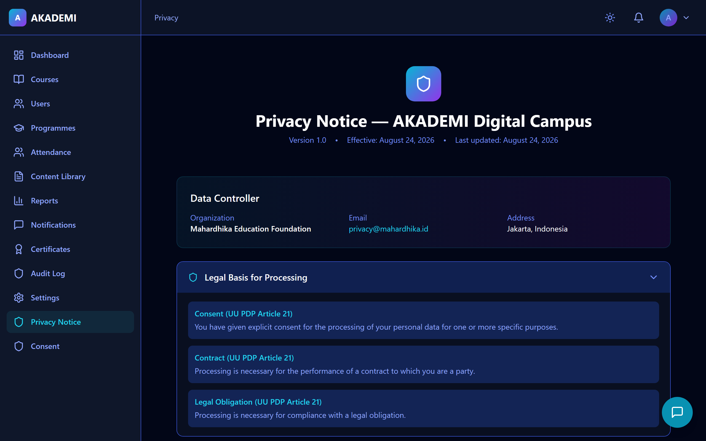
- Role: `all` | Size: 328KB
- **📝 Note:** Privacy notice + data export/deletion sesuai consent.
- **🔄 Sebelum → Sekarang:** Dulu statis; sekarang terkait consent & data export yang diawasi RBAC.

### Consent Management
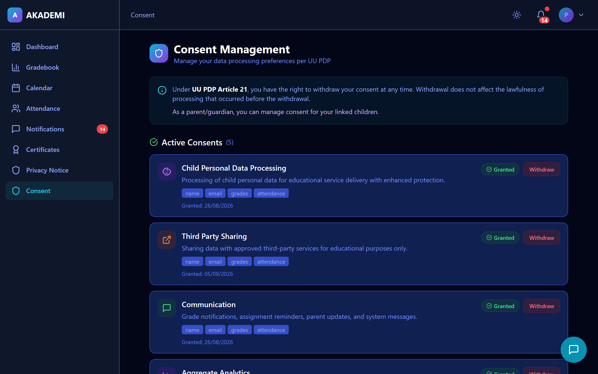
- Role: `parent` | Size: 246KB
- **📝 Note:** Consent management: parent/student mengelola persetujuan.
- **🔄 Sebelum → Sekarang:** Dulu tidak ada; sekarang CRUD consent + RLS.

### Calendar — Take Roll ready ❌
- **Error:** locator.waitFor: Timeout 5000ms exceeded.
Call log:
  - waiting for getByRol
- **📝 Note:** Siap Take Roll di panel kehadiran kalender — gagal capture karena bergantung jadwal hari ini.
- **🔄 Sebelum → Sekarang:** Dulu tombol roll tidak ada; sekarang tersedia tapi perlu seed jadwal hari berjalan agar ter-capture.

### Calendar — Take Roll modal ❌
- **Error:** locator.waitFor: Timeout 5000ms exceeded.
Call log:
  - waiting for getByRol
- **📝 Note:** Modal Take Roll di kalender dengan daftar siswa per jadwal — gagal capture (bergantung tanggal).
- **🔄 Sebelum → Sekarang:** Dulu tidak ada; sekarang modal muncul per jadwal, perlu jadwal hari ini.

### Attendance — Take Roll ready ❌
- **Error:** locator.click: Timeout 30000ms exceeded.
Call log:
  - waiting for locator('
- **📝 Note:** Siap Take Roll dari daftar jadwal Attendance — gagal capture (bergantung jadwal hari ini).
- **🔄 Sebelum → Sekarang:** Dulu read-only; sekarang tombol roll per jadwal, perlu seed jadwal hari ini.

### Attendance — Take Roll modal ❌
- **Error:** locator.click: Timeout 30000ms exceeded.
Call log:
  - waiting for locator('
- **📝 Note:** Modal Take Roll di Attendance dengan save per status — gagal capture (bergantung jadwal).
- **🔄 Sebelum → Sekarang:** Dulu tidak ada; sekarang bisa mark satu kelas, perlu jadwal hari ini.

### Attendance Export — schedules CSV
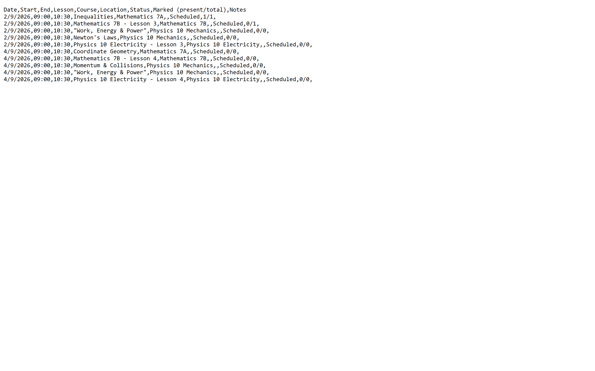
- Role: `instructor` | Size: 105KB
- **📝 Note:** Export CSV jadwal sesuai bulan yang sedang dilihat di panel.
- **🔄 Sebelum → Sekarang:** Dulu export seluruh data; sekarang mengikuti filter bulan panel.

### Attendance Export — records CSV ❌
- **Error:** locator.click: Timeout 30000ms exceeded.
Call log:
  - waiting for locator('
- **📝 Note:** Export CSV records mengikuti tanggal/status/cari di panel — gagal capture (bergantung jadwal).
- **🔄 Sebelum → Sekarang:** Dulu export semua records; sekarang sesuai filter panel.

### Content Library — file upload result
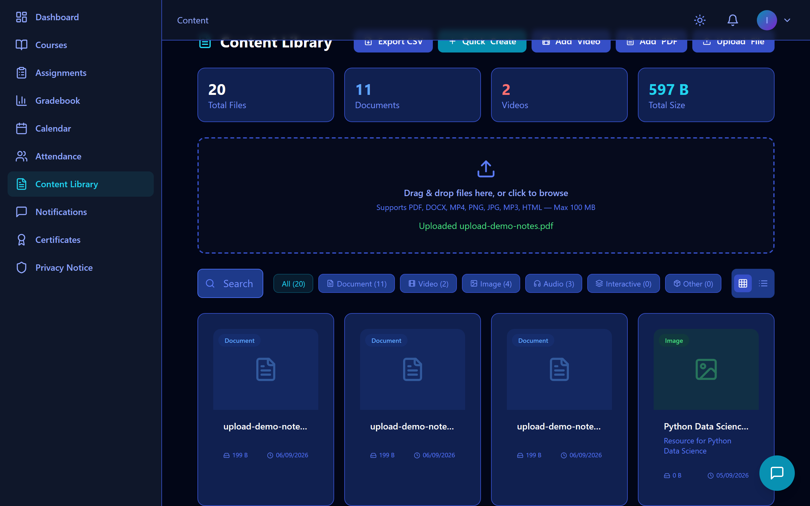
- Role: `instructor` | Size: 198KB
- **📝 Note:** Hasil upload file ke Supabase Storage dengan link file tersimpan.
- **🔄 Sebelum → Sekarang:** Dulu upload gagal; sekarang berhasil via signed URL dan tidak membebani server.

### Content Library — Add Video embed
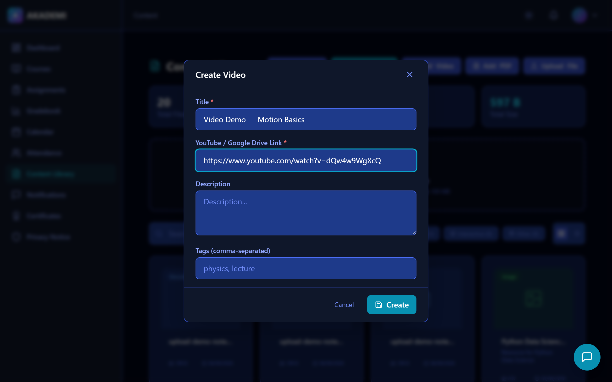
- Role: `instructor` | Size: 321KB
- **📝 Note:** Modal tambah video embed (YouTube / Google Drive) di content library.
- **🔄 Sebelum → Sekarang:** Dulu harus upload file besar; sekarang cukup tempel link dan ter-render inline.

### Essay — video prompt workspace
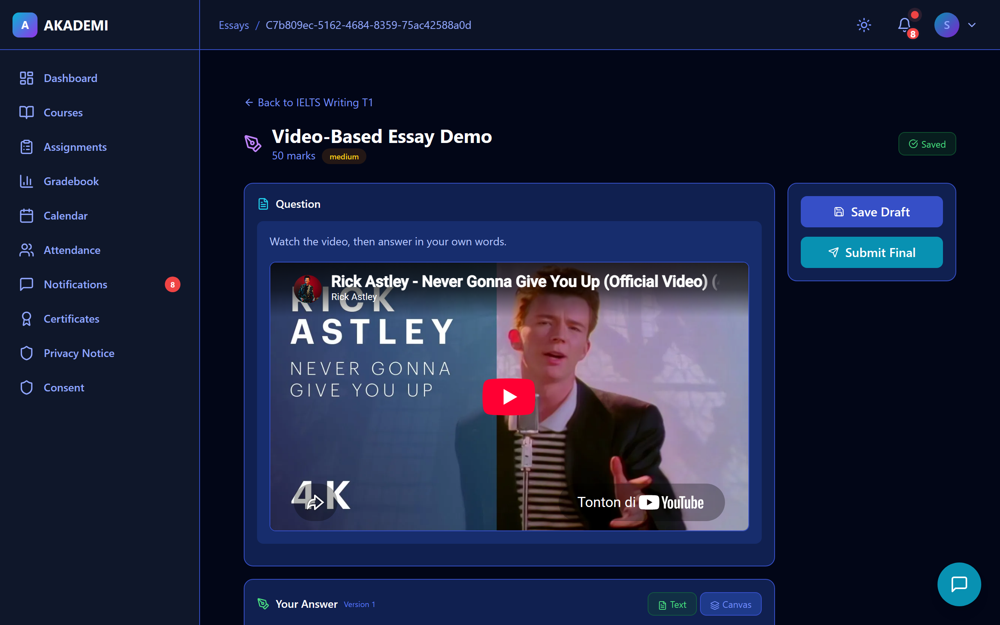
- Role: `student` | Size: 649KB
- **📝 Note:** Workspace essay: video prompt di samping area jawaban student.
- **🔄 Sebelum → Sekarang:** Dulu essay teks saja; sekarang ada prompt video + feedback instructor.

### Assignment — video brief create
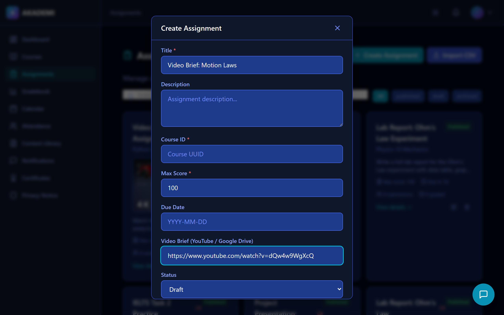
- Role: `instructor` | Size: 399KB
- **📝 Note:** Modal buat assignment dengan field Video Brief (YouTube/Drive).
- **🔄 Sebelum → Sekarang:** Dulu assignment tanpa media; sekarang instructor bisa lampirkan video brief.

### Assignment — video brief detail
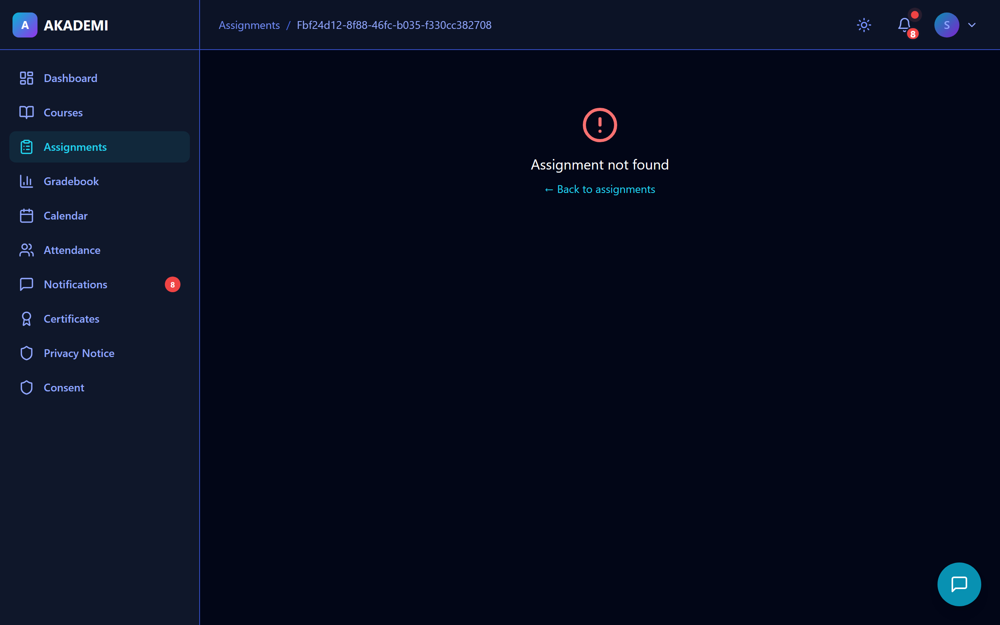
- Role: `student` | Size: 97KB
- **📝 Note:** Detail assignment menampilkan video brief yang ter-render.
- **🔄 Sebelum → Sekarang:** Dulu hanya teks; sekarang embed video tampil di detail untuk student.

### Lesson — video embed player ❌
- **Error:** cannot resolve course
- **📝 Note:** Lesson player dengan embed video — gagal capture (course belum ter-resolve di seed).
- **🔄 Sebelum → Sekarang:** Dulu lesson hanya file upload; sekarang mendukung embed video, perlu seed course.

### Courses — clean seed data
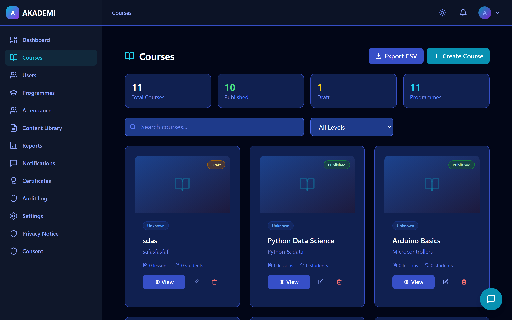
- Role: `all` | Size: 410KB
- **📝 Note:** State kursus setelah dedup + seed bersih: satu organisasi, tanpa orphant course kosong.
- **🔄 Sebelum → Sekarang:** Dulu duplikat & seed crash; sekarang seed idempotent dan data konsisten.

## 📥 Generated CSV Exports

Live CSVs downloaded during the export-flow screenshots (GitHub previews them inline):

- [attendance-records-2026-09-06.csv](exports/attendance-records-2026-09-06.csv)
- [attendance-schedules-2026-09-06.csv](exports/attendance-schedules-2026-09-06.csv)

---

---

## 🔧 Backend Status

| Check | Status |
|-------|--------|
| Django System Check | ✅ (verified at commit time) |
| RBAC Enforcement | ✅ 14/14 tests |
| RBAC Comprehensive (all roles) | ✅ 75/75 tests |
| Consent Tests | ✅ 23/23 tests |
| Notifications Tests | ✅ 70/70 tests |
| Attendance API (roster + roll) | ✅ 16/16 tests |
| Profile Self-Service API | ✅ 12/12 tests |
| Security Tests | ✅ Passed |
| Frontend TypeScript | ✅ 0 errors |
| Frontend Unit Tests | ✅ 50/50 |
| E2E Playwright (chromium, collected) | ✅ 267 test cases |

---

## 📈 Milestone Progress

| Milestone | Status | Target |
|-----------|--------|--------|
| 1. Foundation | ✅ Complete | Day 1-30 |
| 2. Core LMS | ✅ Complete | Day 30-60 |
| 3. Family & Governance | ✅ Complete | Day 60-75 |
| 4. Native Activities | ✅ Complete | Day 60-75 |
| 5. Essay & Canvas | ✅ Complete | Day 75-90 |
| 6. Operations | ✅ Complete | Day 90+ |
| 7. Release | 🟡 In Progress | Oct 2026 |

---

## 🔐 RBAC & Security

- **Tables with RLS:** 59
- **RLS Policies:** 151 (143 public + 8 storage)
- **Helper Functions:** 16
- **Auth Users:** 8
- **Roles:** Owner, Admin, Treasurer, Instructor, Student, Parent, Sponsor, Third Party
- **ViewSets with RBAC permissions:** 34/34 ✅

### RBAC Permission Classes

| Permission Class | ViewSets | Denied Roles |
|---|---|---|
| IsAcademicRole | content, attendance, canvas, courses, lessons, activities, attempts, progress, certificates | treasurer, sponsor, third_party |
| IsConsentRole | consent, data export, data deletion | instructor, treasurer, sponsor, third_party |
| IsSponsorshipRole | sponsorship | instructor, student, parent, treasurer, third_party |
| IsPaymentRole | payments, refunds | instructor, sponsor, third_party |
| IsFinanceRole | invoices (owner, admin, treasurer) | instructor, student, parent, sponsor, third_party |
| IsGradeRole | grades | treasurer, sponsor, third_party |
| IsEssayRole | essays | treasurer, sponsor, third_party |
| IsAssignmentRole | assignments | treasurer, sponsor, third_party |
| IsAdminOrOwner | audit, safeguarding, users, roles, orgs | all non-admin/owner |

---

## 📝 Notes

- All pages render correctly with real API data
- RBAC enforced on both frontend (route guards) and backend (queryset filtering)
- Database connected to Supabase PostgreSQL with full RLS
- Attendance: Take Roll wired on Calendar + Attendance pages; Export CSVs reflect the viewed month and the records panel's date/status/search filters
- Profile self-service: save, MFA toggle, change password and account deletion all call real endpoints (any role can edit own profile)
- Audit log and Canvas exports wired; PDF export from the annotation canvas
- File uploads: Content Library, assignment submissions and essay responses upload to Supabase Storage via signed URLs (PDF/DOCX/image); Content Library has drag-drop + multi-file
- Video embeds: YouTube/Google Drive links render inline (Content Library items and video-based essay prompts) instead of uploading large media files
- 267 E2E test cases per browser project (chromium/firefox/tablet) covering login, CRUD, RBAC, storage, accessibility, responsive

---

*Report generated automatically by AKADEMI Digital Campus*
