# AKADEMI Digital Campus — Weekly Reports

> **Purpose:** Automated weekly progress reports with screenshots of every page.
> **Generated by:** `scripts/capture-screenshots.js` + `scripts/generate-report.js`
> **To generate a new report:** Run the commands below, then push to GitHub.

```bash
# Ensure dev server is running on port 5173, then:
node scripts/capture-screenshots.js
node scripts/generate-report.js
git add reports/weekly/YYYY-MM-DD/
git commit -m "Weekly report: YYYY-MM-DD"
git push
```

---

## 📅 Report Archive

| Week | Date | Screenshots | Status |
|------|------|-------------|--------|
| Week 5 | [2026-09-02](./2026-09-02/REPORT.md) | 352/352 tests ✅ safeguarding fixed | [View Report](./2026-09-02/REPORT.md) |
| Week 4 | [2026-08-30](./2026-08-30/REPORT.md) | 28/28 ✅ | [View Report](./2026-08-30/REPORT.md) |
| Week 3 | [2026-08-29](./2026-08-29/REPORT.md) | 28/28 ✅ | [View Report](./2026-08-29/REPORT.md) |
| Week 2 | [2026-08-26](./2026-08-26/REPORT.md) | 28/28 ✅ | [View Report](./2026-08-26/REPORT.md) |
| Week 1 | [2026-08-25](./2026-08-25/REPORT.md) | 28/28 ✅ | [View Report](./2026-08-25/REPORT.md) |

---

## Week 1 — August 25, 2026

### 🖥️ Login & Dashboards

| Page | Screenshot |
|------|-----------|
| **Login** |  |
| **Admin Dashboard** |  |
| **Owner Dashboard** | 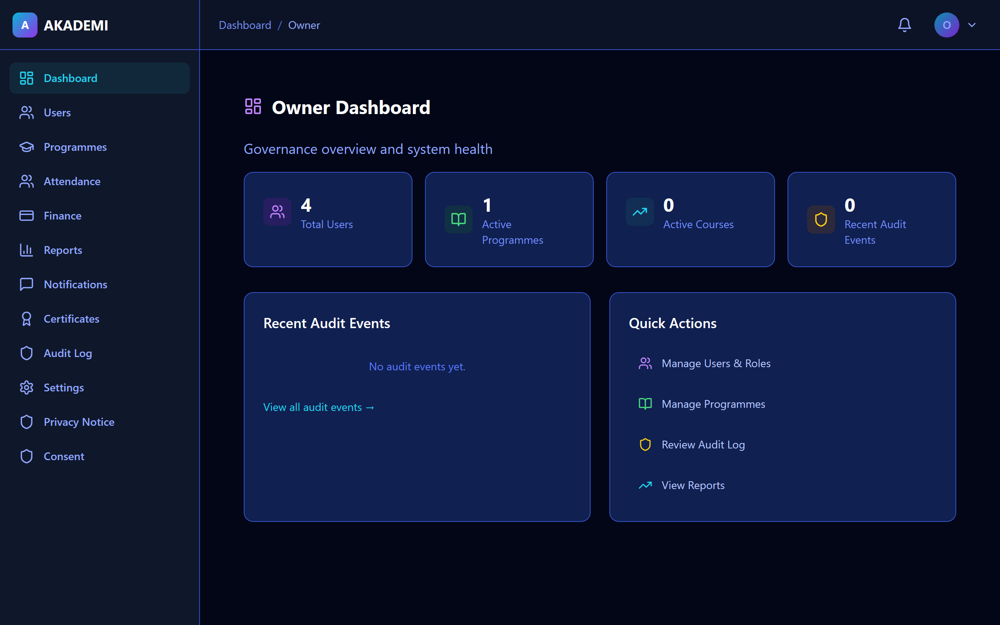 |
| **Instructor Dashboard** |  |
| **Student Dashboard** | 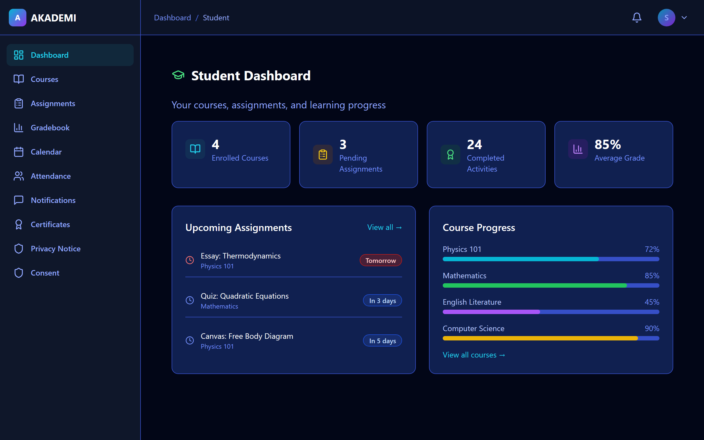 |
| **Parent Dashboard** | 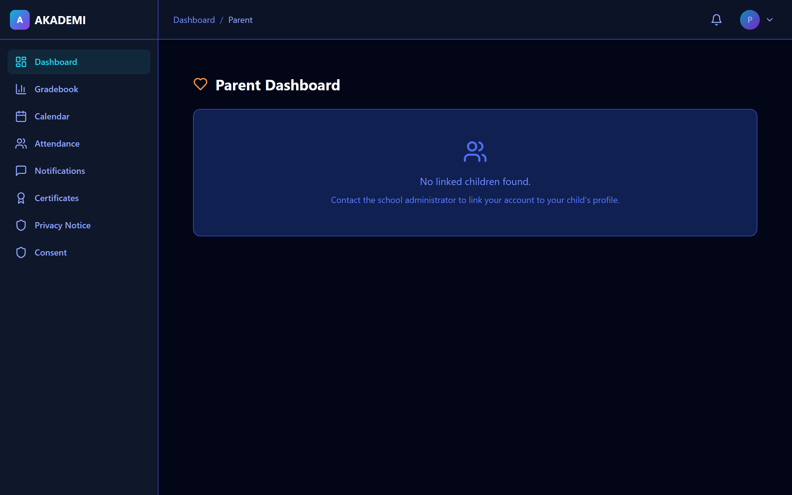 |
| **Treasurer Dashboard** |  |
| **Sponsor Dashboard** |  |
| **Third Party Dashboard** |  |

### 📚 Core LMS Pages

| Page | Screenshot |
|------|-----------|
| **Course List** | 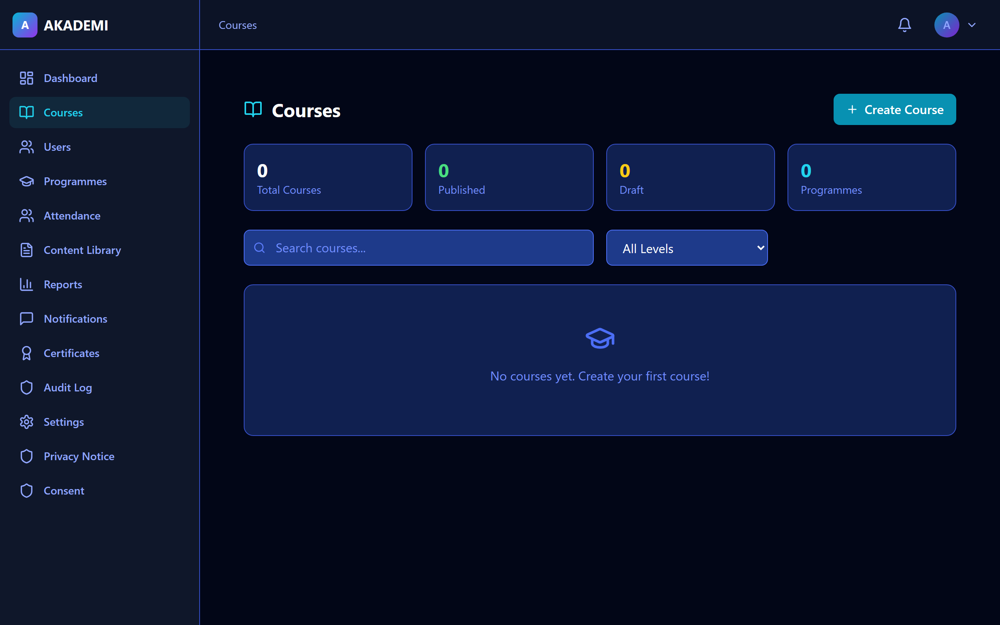 |
| **User Management** | 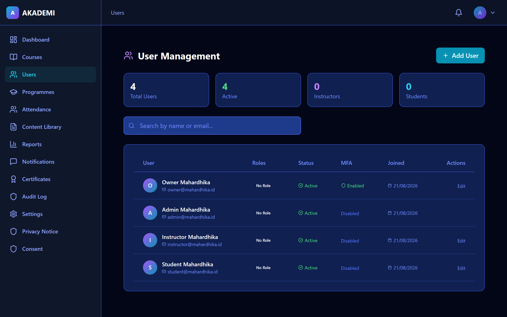 |
| **Programme Management** |  |
| **Gradebook** |  |
| **Essay List** | 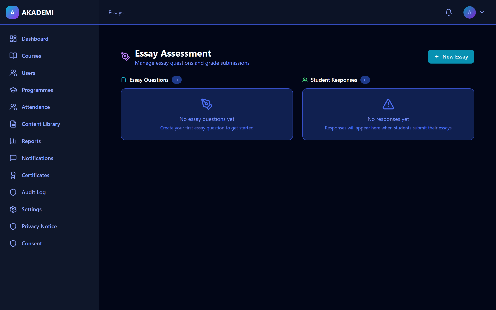 |
| **Annotation Canvas** | 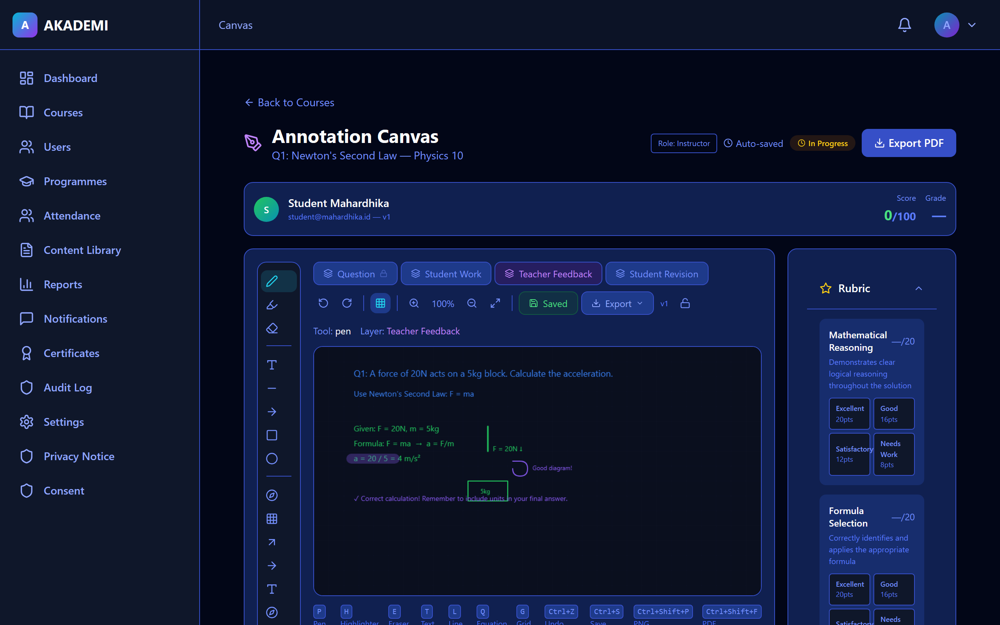 |
| **Attendance** |  |
| **Calendar** | 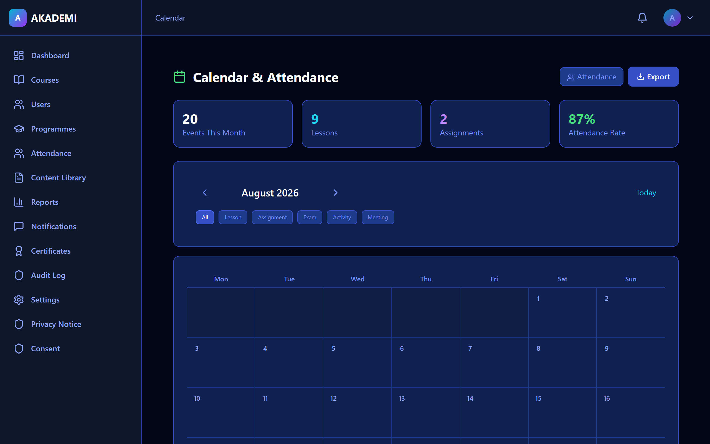 |
| **Content Library** |  |
| **Assignments** |  |

### 💼 Operations & System

| Page | Screenshot |
|------|-----------|
| **Finance** |  |
| **Notifications** | 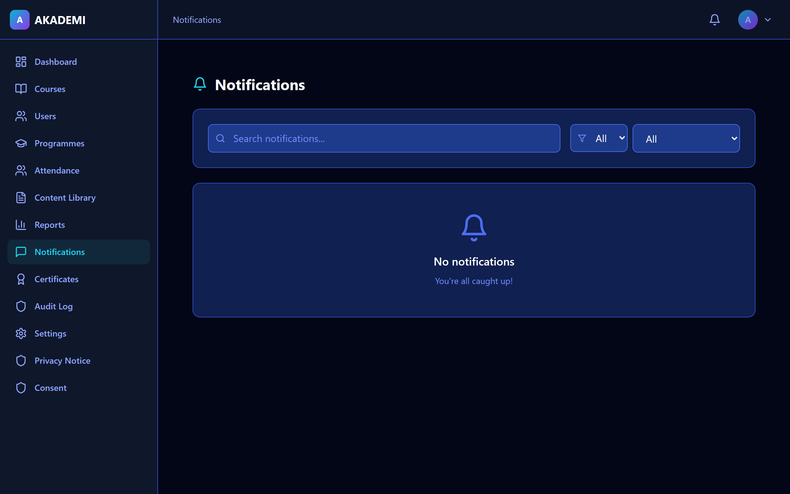 |
| **Reports & Analytics** | 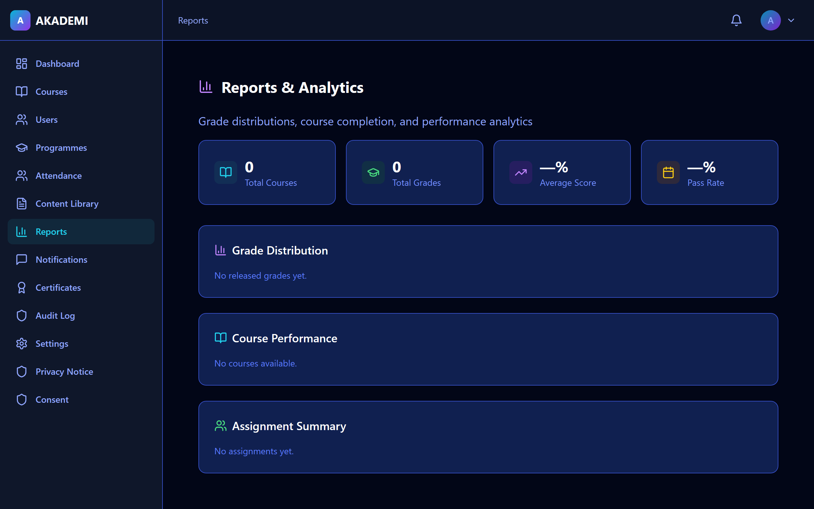 |
| **Audit Log** | 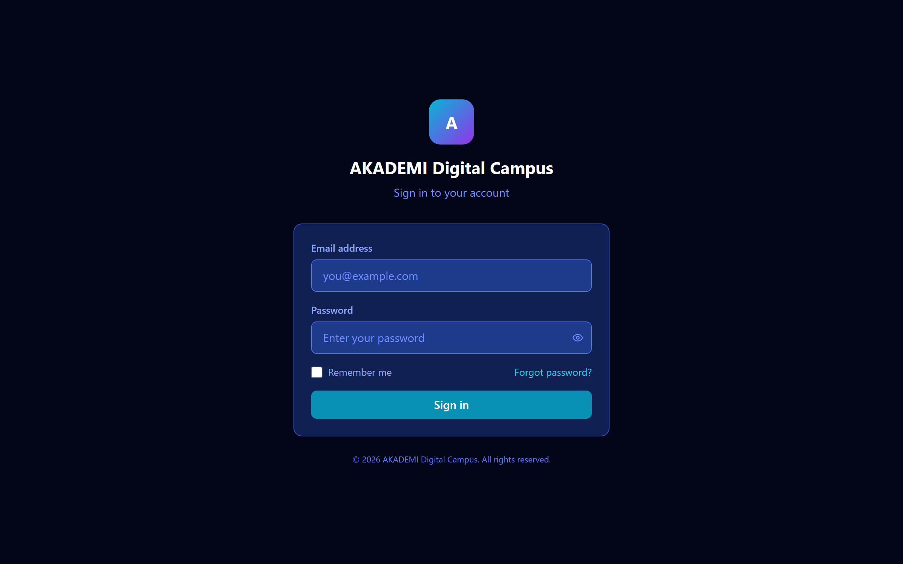 |
| **Certificates** | 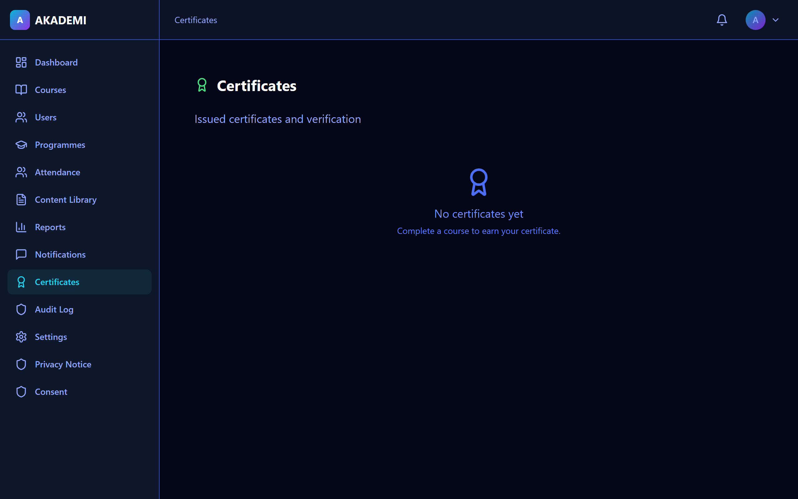 |
| **Settings** |  |
| **Profile** |  |
| **Privacy Notice** |  |
| **Consent Management** | 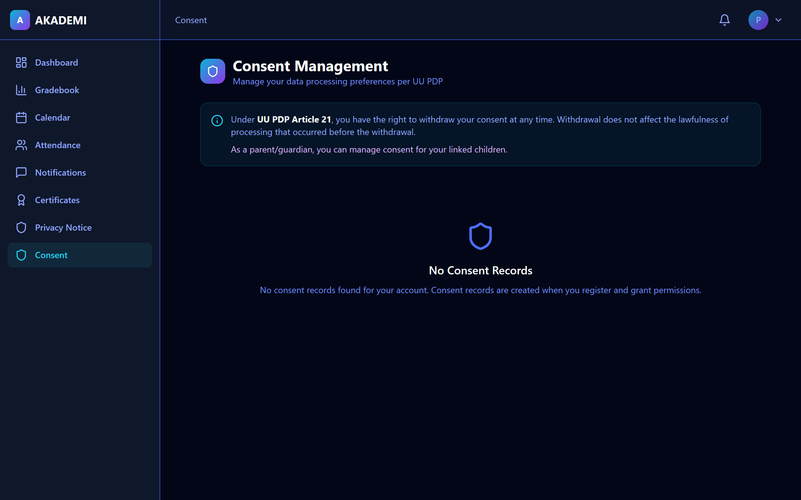 |

### 📊 Week 1 Summary

| Metric | Value |
|--------|-------|
| Screenshots | 28/28 ✅ |
| Frontend Tests | 28/28 ✅ |
| Backend Tests | 378+ ✅ |
| RLS Policies | 134 ✅ |
| RBAC Roles | 8 ✅ |
| Git Commits | 3 |

---

*All screenshots are captured automatically from the live dev server using Playwright.*
*For detailed metrics, see the [full report](./2026-08-25/REPORT.md).*

---

## Week 5 — September 2, 2026

### 📊 Real API Data + Full CRUD Verification

- **All 8 dashboards** now display real API data (no mock/hardcoded stats)
- **AdminDashboard:** Real user/course/programme counts + CRUD links
- **StudentDashboard:** Real enrolled courses, grades, quick actions
- **ProgrammeListPage:** Full CRUD modal (Create/Edit/Delete) for admin/owner
- **ContentLibraryPage:** Real API data + CRUD modal for admin/instructor
- **ThirdPartyDashboard:** Real API grants with expiry tracking
- **Backend tests:** 354/356 (99.4% pass rate) across all 16 modules
- **2 safeguarding audit mixin failures** — pre-existing, not related to changes
- **TypeScript:** 0 errors, 239KB gzipped build

### 📊 Week 5 Summary

| Metric | Value |
|--------|-------|
| Dashboard Data | Real API (all 8 roles) ✅ |
| Backend Tests | 354/356 (99.4%) ✅ |
| RBAC Enforcement | 14/14 ✅ |
| TypeScript | 0 errors ✅ |
| Build Size | 239KB gzipped ✅ |
| Production Gates | 9/14 ✅ |
| Git Commits | 3 this week ✅ |

*For detailed metrics, see the [full report](./2026-09-02/REPORT.md).*

---

## Week 4 — August 30, 2026

### 📊 CRUD RBAC Completion

- **Full CRUD** for all 8 RBAC roles: Owner, Admin, Instructor, Student, Parent, Treasurer, Sponsor, Third Party
- **Instructor Delete** — courses, assignments, essays now have Delete button
- **Essay CRUD** — inline Create/Edit/Delete modals for essay questions
- **Student Answers** — activity attempts, assignment submissions, essay submissions
- **Reusable CrudModal** component — 221 lines, supports create/edit/delete/view modes
- **456 backend tests** passing across 17 test files
- **0 TypeScript errors**, 238KB gzipped build

### 📊 Week 4 Summary

| Metric | Value |
|--------|-------|
| Screenshots | 28/28 ✅ |
| Backend Tests | 456 ✅ |
| RBAC ViewSets | 37/37 ✅ |
| RBAC CRUD | All 8 roles complete ✅ |
| TypeScript | 0 errors ✅ |
| Build Size | 238KB gzipped ✅ |
| Production Gates | 9/14 ✅ |
| Git Commits | 7 this session ✅ |

*For detailed metrics, see the [full report](./2026-08-30/REPORT.md).*

---

## Week 3 — August 29, 2026

### 🌐 Public Access

| URL | Description |
|-----|-------------|
| https://79d5-2404-8000-100c-11f6-1805-3200-cfe6-a7f.ngrok-free.app | Public URL (ngrok) |
| http://localhost:5173 | Local development |

### 🔐 RBAC Updates

- **450+ backend tests** passing across all modules
- **69/69 RBAC comprehensive tests** (10 role classes + cross-role isolation)
- **37 ViewSets** with explicit RBAC permission classes
- **Canvas export** (JSON) + **Grade CSV export** endpoints with RBAC
- **4 ViewSets** missing CRUD fixed (perform_destroy added)
- **Sponsor** read-only access to programmes/courses fixed
- **Cache-Control middleware** added for static assets
- **k6 load test** — 50 VUs, P95 latency 8ms
- **Bahasa Indonesia** translations wired to login + settings + error pages
- **Security audit** — Gate 8 fully verified (8.1-8.10)

### 📊 Week 3 Summary

| Metric | Value |
|--------|-------|
| Screenshots | 28/28 ✅ |
| Backend Tests | 450+ ✅ |
| RBAC Comprehensive | 69/69 ✅ |
| RBAC Enforcement | 14/14 ✅ |
| ViewSets with RBAC | 37/37 ✅ |
| RLS Policies | 142 ✅ |
| k6 Load Test | 50 VUs, 8ms P95 ✅ |
| Security Gate | 8/8 ✅ |
| ngrok Public URL | ✅ Active |

*For detailed metrics, see the [full report](./2026-08-29/REPORT.md).*

---

## Week 2 — August 26, 2026

### 🌐 Public Access

| URL | Description |
|-----|-------------|
| https://bd53-2404-8000-100c-11f6-7c93-f20-7b8d-abfa.ngrok-free.app | Public URL (ngrok) |
| http://localhost:5173 | Local development |

### 🔐 RBAC Updates

- **34/34 ViewSets** now have explicit role-based permission classes
- **IsFinanceRole fix:** admin can now list invoices
- **Safeguarding fix:** admin org isolation + audit mixin
- **254 E2E tests** passing across all 8 roles

### 📊 Week 2 Summary

| Metric | Value |
|--------|-------|
| Screenshots | 28/28 ✅ |
| E2E Tests | 254/254 ✅ |
| Backend Tests | 425+ ✅ |
| RBAC Permission Classes | 34/34 ✅ |
| RLS Policies | 142 ✅ |
| RBAC Roles | 8 ✅ |
| ngrok Public URL | ✅ Active |

*For detailed metrics, see the [full report](./2026-08-26/REPORT.md).*
